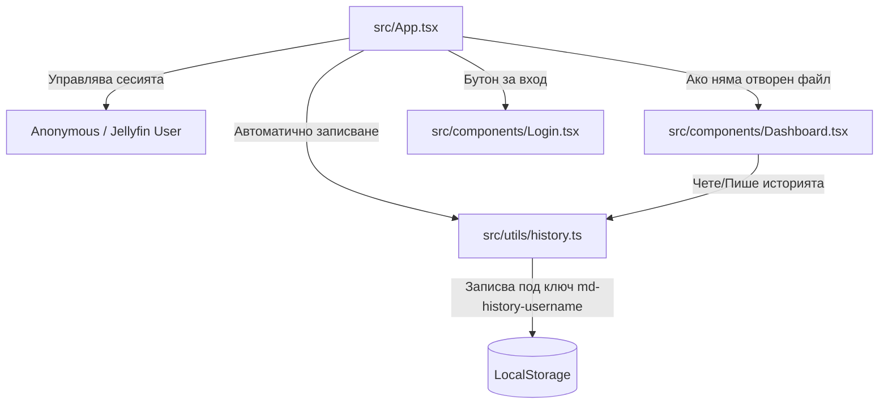

# Дизайн Спецификация: Свободен Достъп и Управление на Историята

Тази спецификация дефинира архитектурата и потребителския интерфейс за преминаване от принудителен логин екран към свободен достъп с локално съхранение на историята на документите (LocalStorage), персонализирана за всеки Jellyfin потребител.

---

## 🏛️ Архитектура на Системата



### 1. Декуплиране на Оторизацията и Свободен Достъп
*   При зареждане приложението стартира в **Свободен режим (Anonymous Mode)**.
*   Лентата с инструменти (`Toolbar`) се променя:
    *   **Ако не е логнат:** Показва се бутон **"Вход"** с икона `LogIn`. При натискане се отваря красив модален прозорец с Jellyfin формата за вход.
    *   **Ако е логнат:** Показва се аватара, името на потребителя и малък бутон за изход (`LogOut`), каквито бяха разработени досега.
*   Прозорецът за вход (`Login.tsx`) се променя от цяла страница в **модален диалог** (Overlay Modal) с плавно замъгляване (`backdrop-filter: blur(10px)`).

### 2. Управление на Историята в LocalStorage (`src/utils/history.ts`)
За да запазим приложението бързо и без необходимост от бекенд сървър, историята се управлява клиентски.
*   **Ключове в LocalStorage:**
    *   Анонимна история: `md-history-anonymous`
    *   Потребителска история: `md-history-${username}` (напр. `md-history-atanas` за Jellyfin потребител `atanas`).
*   **Прехвърляне на история:** При успешно влизане в акаунт, анонимната история се прехвърля автоматично в Jellyfin профила, за да не се губят локално разглежданите документи.

#### Структура на данните (`HistoryItem`):
```typescript
export interface HistoryItem {
  id: string;          // Уникален ID (генериран от timestamp)
  fileName: string;    // Име на файла (напр. "welcome.md")
  content: string;     // Текстовото съдържание на документа
  lastOpened: number;  // Време на последно отваряне (timestamp)
  isPinned: boolean;   // Дали е закачен/любим (закачените седят най-отгоре)
  sizeBytes: number;   // Размер на документа в байтове
}
```

---

## 🎨 Потребителски Интерфейс (UI)

Новият начален екран тип **Дашборд** (`src/components/Dashboard.tsx`) ще се показва само когато няма отворен файл (т.е. при празно съдържание и липса на име на файл).

### Елементи на Дашборда:
1.  **Приветстващ банер:**
    *   За анонимни потребители: *"Добре дошли в MDReader! Влезте в своя Jellyfin профил за персонализирана история."*
    *   За логнати потребители: *"Радваме се да Ви видим, {username}! Вашата лична библиотека."*
2.  **Бързи Действия (Quick Actions):**
    *   Бутон **"📝 Нов Документ"** (стартира чист нов файл).
    *   Бутон **"📁 Отвори Файл"** (отваря системен диалог за избор на файл от диска).
3.  **Търсачка:**
    *   Поле за филтриране в реално време на историята по име на файл.
4.  **Списък "Закачени / Любими" (Pinned Files):**
    *   Показва се най-отгоре, оцветен в марков ментов цвят (`--accent`).
    *   Списък от документи, отбелязани с иконка 📌.
5.  **Списък "Скорошни" (Recent Files):**
    *   Списък от всички останали документи, сортирани по време на последно отваряне.
6.  **Управление на записите:**
    *   Всеки ред съдържа името, размера, времето на отваряне, бутон за **Закачане/Откачане** (икона 📌) и бутон за **Изтриване** от историята (икона `Trash`).

---

## 💾 Автоматично Запазване на Чернови (Auto-Save)

В `src/App.tsx` ще интегрираме ефект, който следи за промени по текущия отворен документ:
*   Когато документът се редактира и `isModified` стане `true`, се задейства дебънсиран таймер (3 секунди).
*   След изтичане на таймера, съдържанието се записва автоматично в историята под съответния ключ.
*   Това предпазва от неочаквана загуба на данни при затваряне на таба.

---

## 🧪 План за Верификация

1.  **Локален тест на Свободния режим:**
    *   Отворете приложението в анонимен режим. Трябва директно да се зареди Дашборда с опция за нов файл или отваряне.
    *   Създайте документ, напишете текст — проверете дали се появява в секция "Скорошни" на Дашборда след затваряне на файла.
2.  **Тест на Закачане и Изтриване:**
    *   Закачете документ — той трябва да се премести най-отгоре в секция "Закачени".
    *   Изтрийте го — трябва да изчезне напълно от LocalStorage.
3.  **Тест на Jellyfin Логин модала:**
    *   Кликнете на "Вход" в Toolbar-а, въведете Jellyfin парола/потребителско име.
    *   Уверете се, че модалът се затваря успешно, превключва се сесията и историята се сменя към специфичната за потребителя.
4.  **Проверка на TypeScript компилацията:**
    *   Изпълнете `npm run build` за проверка на нулеви типови грешки.
